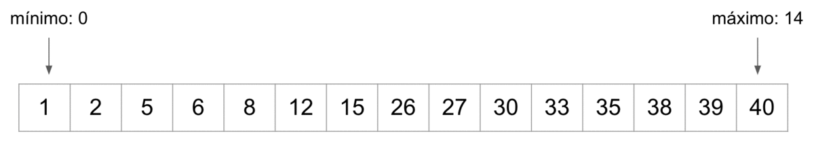

# Busqueda Binaria.



<hr>

La búsqueda binaria es un algoritmo eficiente para encontrar un elemento en un arreglo ordenado. En lugar de revisar cada elemento uno por uno (como en la búsqueda lineal), la búsqueda binaria divide el arreglo por la mitad en cada paso, descartando la mitad que no puede contener el valor buscado.

**Cómo funciona:**

- Empiezas con dos punteros: uno al inicio (inicio) y otro al final (fin) del arreglo.

- Calculas la posición del medio (medio).

- Si el valor en medio es igual al que buscas, ¡lo encontraste!

- Si el valor en medio es mayor que el que buscas, ajustas fin a medio - 1.

- Si es menor, ajustas inicio a medio + 1.

- Repites hasta encontrar el valor o hasta que inicio > fin.


Ejemplo en código JavaScript.
----------------------------

```js
function busquedaBinaria(arr, objetivo) {
  let inicio = 0;
  let fin = arr.length - 1;

  while (inicio <= fin) {
    let medio = Math.floor((inicio + fin) / 2);

    if (arr[medio] === objetivo) {
      return medio; // Devuelve el índice
    } else if (arr[medio] < objetivo) {
      inicio = medio + 1;
    } else {
      fin = medio - 1;
    }
  }

  return -1; // No encontrado
}

const numeros = [1, 3, 5, 7, 9, 11, 13];
console.log(busquedaBinaria(numeros, 9)); // Salida: 4
```

Importante: El arreglo debe estar ordenado de menor a mayor para que la búsqueda binaria funcione correctamente.

# Algoritmo de mezclado aleatorio `Fisher-Yates Shuffle`

Es un algoritmo eficiente y justo para desordenar aleatoriamente (barajar) los elementos de un arreglo. Se asegura de que todas las permutaciones posibles del arreglo tengan la misma probabilidad de ocurrir.

-------

Supongamos que tienes este arreglo:

```JavaScript
let arr = [1, 2, 3, 4];
```

El algoritmo siguie estos pasos:

1. Empieza desde el final del arreglo y recorrer hacia el principio.

2. Para cada posición `i`, elige un índice aleatorio `j` entre `0` y `i`.

3. Intercambia los elementos en las posiciones `i` y `j`.

**Código ejemplo:
```Javascript
 
  for (let i = arr.length - 1; i > 0; i--) {
   
    let j = Math.floor(Math.random() * (i + 1));

    
    let temp = arr[i];
    arr[i] = arr[j];
    arr[j] = temp;
  }


```

Supón que `arr = [1, 2, 3, 4]`

Iteración 1 (`i = 3`): elige `j = 1` → intercambia `arr[3]` y `arr[1]` → `arr = [1, 4, 3, 2]`

Iteración 2 (`i = 2`): elige `j = 0` → intercambia `arr[2]` y `arr[0]` → `arr = [3, 4, 1, 2]`

Iteración 3 (`i = 1`): elige `j = 1` → intercambia `arr[1] y arr[1]` (no cambia)

Resultado final: `arr = [3, 4, 1, 2]` (mezclado aleatoriamente)


**Ejercicios:**

1. Crea un programa en JavaScript que genere un arreglo de un millón de números consecutivos del 0 al 999999. Luego, implementa dos funciones: una que realice una búsqueda lineal recorriendo el arreglo elemento por elemento, y otra que realice una búsqueda binaria dividiendo. Establece como número objetivo el último valor del arreglo (999999) y mide el tiempo que tarda cada algoritmo en encontrarlo utilizando ``console.time()` y `console.timeEnd()`, comparando así el rendimiento de ambas búsquedas.

2. Crea un programa en JavaScript que primero genere un arreglo de 20 números aleatorios entre 1 y 100. Luego, ordena el arreglo utilizando el método de burbuja para ordenarlo de menor a mayor. Finalmente, solicita al usuario un número específico y, utilizando el algoritmo de búsqueda binaria, verifica si ese número se encuentra en el arreglo ordenado, mostrando su posición si lo encuentra. y si no lo encuentra debe mostrar un mensaje avisando que no lo encontro.

3. Crea un programa en JavaScript que primero genere un arreglo de 10 números aleatorios entre 1 y 100. Luego, ordena el arreglo utilizando el método de burbuja, seguido desordenelo con el algoritmo de mezclado aleatorio de `Fisher-Yates`

4. Crea un programa en JavaScript que genere un mazo de cartas con 48 cartas, combinando los palos "copa", "oro", "palo" y "espada", cada uno con valores del 1 al 12. Luego, mezcla aleatoriamente el mazo utilizando el algoritmo de `Fisher-Yates`, de forma que cada carta conserve su número y su palo como una unidad. Finalmente, muestra el mazo mezclado y la cantidad total de cartas.

5. A partir de un mazo de 48 cartas españolas ya generado y mezclado (con cartas del 1 al 12 de los palos "copa", "oro", "palo" y "espada"), crea un programa en JavaScript que elimine todas las cartas con número 8 y 9, dejando un mazo de 40 cartas. Luego, reparte 4 grupos de 3 cartas cada uno, simulando una repartija inicial. Cada grupo debe contener cartas únicas y cada carta debe conservar su número y palo como una unidad. Finalmente, muestra en consola las 4 manos de cartas.

**Resultado de salida:**

```bash
Jugador 1:
  11 de copa
  11 de palo
  6 de oro
Jugador 2:
  5 de copa
  3 de espada
  2 de copa
Jugador 3:
  7 de copa
  2 de palo
  11 de espada
Jugador 4:
  3 de copa
  4 de espada
  12 de palo
```